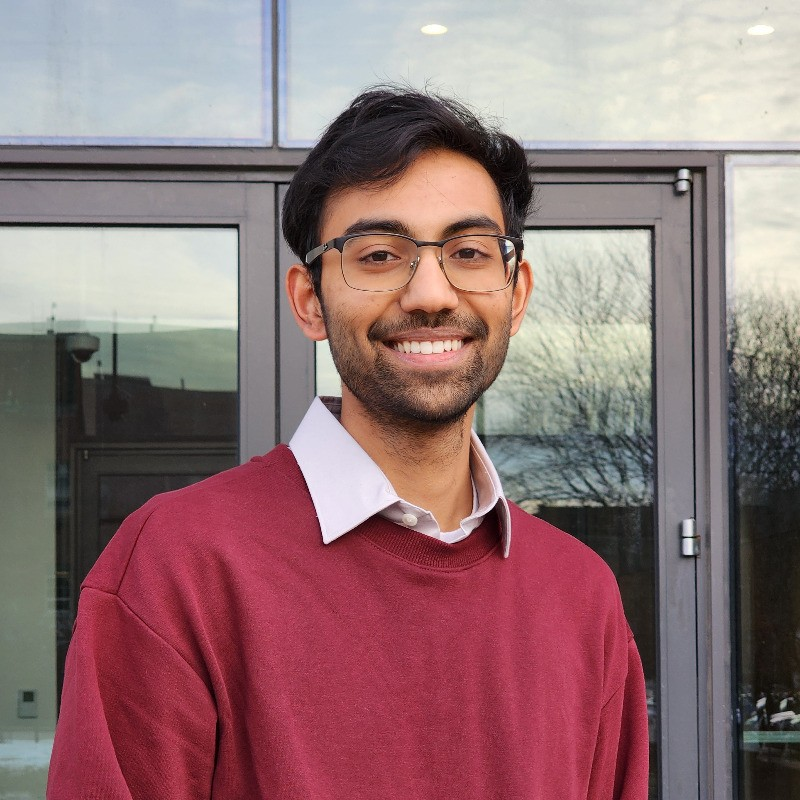

# About Me

## Who I Am

I'm Akaash Kashyap, a graduating senior at the University of Illinois Urbana-Champaign (UIUC). My academic focus and passion lie in network engineering, systems programming, and cybersecurity.

## Education

**University of Illinois Urbana-Champaign**  
B.S. in Computer Engineering  
*Expected Graduation: May 2025*

## Technical Expertise

- **Computer Architecture**: Processor design, memory systems, hardware optimization
- **Systems Programming**: Operating systems, low-level programming, embedded systems
- **Security**: Splunk, Burp Suite, Wireshark, System hardening, vulnerability assessment, secure architecture design
- **Programming Languages**: C/C++, Python, RISC V Assembly, x86 Assembly Verilog/VHDL

## Personal Interests

When I'm not working on technical projects, I enjoy [your hobbies/interests - e.g., hiking, playing chess, reading about technology history, etc.]. I'm always looking to connect with other professionals and students in my field.

## Get in Touch

Feel free to reach out through my [contact page](/contact) or connect with me on [LinkedIn](https://www.linkedin.com/in/yourprofile).